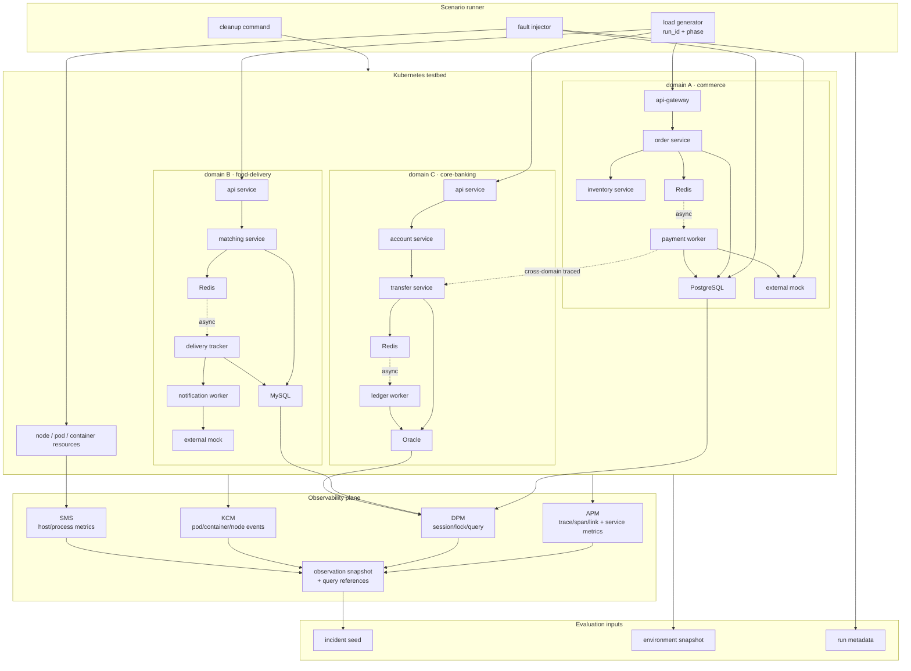
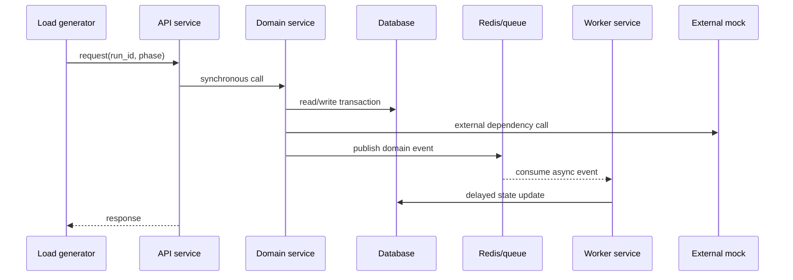

# 테스트베드 환경 설계

이 문서는 RCA agent 평가에 사용할 테스트베드 **환경**을 정의한다. 여기서
환경은 서비스, 인프라, 관측 수집, 실행 격리, 산출물 보존 방식을 뜻한다.
개별 장애 케이스와 카탈로그 설계는 [시나리오 설계](spec-scenario-design.md)가
담당하고, 시나리오를 golden 레코드로 변환하는 규칙은 [시나리오 작성 규칙](spec-scenario-authoring.md)이
담당한다.

이 테스트베드는 RCA agent 평가만을 위한 것이 아니라, lucida-next의 이상감지,
이벤트 클러스터링, 인시던트 상관 등 여러 기능 평가가 함께 올라타는 **공용 평가
기반**이다. 각 평가의 정답(ground truth)과 평가 하네스는 해당 기능 담당자가
따로 소유하며, 이 문서는 그 평가들이 쓸 수 있을 만큼 환경이 충분히 풍부하고
관측 표면이 넓다는 것을 보장하는 데 초점을 둔다. 단, 상세 설계는 RCA 관점에서
전개하며, 이상감지·클러스터·인시던트용 정답 계약은 이 문서 범위 밖이다.

## 1. 환경 목표

테스트베드는 데모용 서비스 묶음이 아니라 RCA 평가를 가능하게 하는 실험 장치다.
따라서 환경 자체가 다음 능력을 제공해야 한다.

- 정상 상태와 장애 상태를 반복 실행해 비교할 수 있다.
- 애플리케이션, 데이터베이스, 호스트, 컨테이너, 네트워크, 웹 관측을 한
  incident 시간창 안에서 함께 조회할 수 있다.
- 원인 계열과 증상 계열이 다를 때도 topology와 시간 관계를 따라갈 수 있다.
- 장애 주입, 부하, 관측 수집, cleanup이 서로 독립적으로 제어된다.
- 실행 결과를 평가 하네스가 재사용할 수 있는 산출물로 보존한다.

비목표:

- 실제 운영 환경 전체를 그대로 복제하지 않는다.
- 운영자 검토 없이 자동 조치를 수행하지 않는다.
- 시나리오 정답 메타데이터를 agent 입력에 노출하지 않는다.
- 특정 알람명이나 서비스명에 과적합해야만 풀리는 환경을 만들지 않는다.

## 2. 구성 원칙

테스트베드는 세 층으로 나눈다.

| 층 | 역할 | 요구 조건 |
| --- | --- | --- |
| 애플리케이션 층 | 사용자 요청, 서비스 간 호출, 비즈니스 상태 변화 생성 | 여러 서비스, 동기 호출, 비동기 경로, 외부 의존 흉내 |
| 인프라 층 | DB, 큐, 캐시, 컨테이너, 호스트, 네트워크 자원 제공 | 원인 주입 지점과 cleanup 경로를 독립 제어 |
| 관측 층 | metric, trace, log, event, topology, change 수집 | 지지 근거, 반증 근거, 누락 근거를 표현 |

도메인은 세 개를 둔다. 한 도메인만 있으면 agent가 서비스 이름, topology
모양, 특정 endpoint 패턴에 과적합하기 쉽다. 두 개로도 과적합은 줄지만, 세
개를 두면 서로 다른 DB 엔진과 서로 다른 업무 흐름을 동시에 확보할 수 있어
관측 다양성과 cross-domain 시나리오 여지가 커진다. 도메인별 비즈니스 모델과
DB 엔진은 달라도 배포 방식, 관측 태그, run metadata 형식은 같아야 한다.

## 3. 권장 v1 아키텍처

v1 테스트베드는 처음부터 모든 관측 계열을 완성하려고 하지 않는다. 먼저
재현 가능한 관측 계약을 만들고, 그 위에 계열을 확장한다. 이 권장안은
[Lucida Next 데이터 수집 참조](ref-lucida-next-data-collection.md)와
`../lucida-next`의 DDL·수집기 코드를 대조한 **source-level 구축 가설**이며,
실제 테스트베드에서 수집 데이터가 안정적으로 들어오는지는 §7의 live
validation을 통과해야 확정한다.

권장 v1 구성:

| 영역 | 선택 | 이유 |
| --- | --- | --- |
| Runtime | Kubernetes 계열 | pod/container lifecycle, restart, OOM, resource limit을 자연스럽게 재현 |
| 애플리케이션 | instrumentation이 쉬운 단일 stack | trace, metric, log 형식의 일관성 확보 |
| DB | PostgreSQL + MySQL + Oracle (도메인별 1종) | DPM 식별자 두 계열(`sql_hash`/`sql_id`)을 함께 밟고, Oracle은 DPM 전용 collector·최다 핸들러 경로를 검증 |
| Cache/Queue | Redis | 비동기 전파, queue backlog, cache 장애를 간단히 구성 |
| 외부 의존 | HTTP mock service | timeout, 5xx, latency injection을 독립 제어 |
| 부하 생성 | k6 또는 Locust | run id, phase, target endpoint를 남기기 쉬움 |
| 관측 | metric + trace + log + event + topology | RCA가 원인, 증상, 반증, 시간 관계를 함께 조회 |

DB 엔진은 세 도메인에 PostgreSQL, MySQL, Oracle을 하나씩 배치한다. 모두
lucida-next DPM collector가 지원하는 엔진이다(`collector-dpm/dbpoll/poll.go`의
engine switch로 확인). 핵심은 DPM의 SQL 식별자 정규화가 두 계열로 갈린다는
점이다. PostgreSQL만 `sql_hash` 계열(세션은 Java hashCode, TopSQL은 queryid)이고,
MySQL·Oracle을 포함한 나머지 관계형 엔진은 `sql_id` 계열이다.

> **core-banking DB = Oracle 확정 (2026-07-12, MariaDB 폐기).** 초기 설계는
> "상용 DB는 라이선스 비용 때문에 Phase 1 제외"였으나, ① DPM이 Oracle 전용
> collector와 최다 핸들러를 갖고 있어 검증 가치가 가장 크고, ② Oracle 23ai
> Free(`gvenzl/oracle-free`)는 무비용 + ARM64 정식 포팅이라 제외 근거가
> 소멸했다. MariaDB의 "세션 hashCode→typed `sql_id` 하이브리드" 시험 항목은
> 이 전환으로 범위에서 빠진다(필요 시 확장 후보).

Phase 1에서는 APM, DPM, SMS를 우선 검증 대상으로 둔다. KCM은 코드·DDL상
Kubernetes resource target 모델이 준비되어 있으므로, 테스트베드에 KCM collector
설치가 포함되면 우선 후보로 올린다. NMS와 WPM/WebURL은 환경 연결 비용과
dimension 정규화 리스크가 더 크므로, core 관측 계약이 안정된 뒤 확장한다.

### 3.1 최소 도메인 형태

도메인 이름과 비즈니스 의미는 추후 바꿀 수 있지만, v1에서는 서로 다른 업무
흐름과 서로 다른 DB 엔진을 가진 세 도메인을 둔다.

| 도메인 | 서비스 예 | DB 엔진 | 상태 저장소 | 외부 의존 | 잘 만드는 장애 |
| --- | --- | --- | --- | --- | --- |
| A · commerce | api-gateway, order, inventory, payment worker | PostgreSQL (`sql_hash`) | PostgreSQL, Redis | payment mock | 재고 lock 경합, slow query, payment 외부의존 timeout |
| B · food-delivery | api, matching, delivery tracker, notification worker | MySQL (`sql_id`) | MySQL, Redis | notification mock | 비동기 매칭 backlog, 추적 이벤트 지연, 알림 큐 적체 |
| C · core-banking | api, account, transfer, ledger worker | Oracle (`sql_id`) | Oracle, Kafka | — | 이체 트랜잭션 lock, 원장 정합성 대기, connection pool 고갈 |

세 도메인은 같은 runner, 같은 label 규칙, 같은 observation snapshot 형식을 쓴다.
비즈니스 모델과 DB 엔진만 달라야 한다.

commerce의 payment worker는 core-banking의 transfer 서비스를 호출하는
**cross-domain 경로**를 하나 가진다. 이 호출은 trace context가 전파되도록
계측해야 하며(§4), 그래야 lucida-next가 도메인 경계를 넘는 `apm_call` edge를
실측 trace로 생성하고 두 도메인의 증상을 하나의 의존성 그래프·인시던트로
연결할 수 있다. 이 경로는 [cross-domain 시나리오]의 근거 edge가 된다.

### 3.2 도메인 내부 호출 흐름

각 도메인은 동기 호출 경로와 비동기 경로를 모두 가져야 한다.

이 구조는 같은 환경에서 DB 원인, 외부 의존 원인, 비동기 backlog, 서비스 내부
지연, 컨테이너 lifecycle 문제를 모두 만들 수 있게 한다.

### 3.3 구축 순서

권장 구축 순서:

1. 단일 도메인(commerce) 4서비스 + PostgreSQL + Redis + external mock으로 skeleton을 만든다.
2. 정상 요청 하나에서 trace, metric, log, topology가 연결되는지 확인한다.
3. run metadata와 observation snapshot 형식을 확정한다.
4. 두 번째 도메인(food-delivery, MySQL)을 추가해 도메인 과적합과 DB 엔진 과적합을 줄인다.
5. 세 번째 도메인(core-banking, Oracle)을 추가하고, commerce payment → banking transfer cross-domain 호출을 trace 전파와 함께 계측한다.
6. cross-domain `apm_call` edge가 실측 trace로 생성되고 두 도메인 증상이 하나의 의존성 그래프로 이어지는지 확인한다.
7. KCM과 SMS 관측을 붙여 container/host 원인 후보를 만들 수 있게 한다.
8. DPM 관측을 붙여 세 엔진의 session, lock, query 근거와 `sql_hash`/`sql_id` 식별자를 만든다.
9. NMS와 WPM은 Phase 1 후반 또는 Phase 2에서 확장한다.

## 4. 애플리케이션 환경

각 도메인은 다음 특성을 가져야 한다.

- 4개 내외의 서비스로 구성한다(api 진입, 도메인 서비스 2개, worker 1개 형태).
- 하나 이상의 synchronous request chain을 가진다.
- 하나 이상의 asynchronous 또는 delayed path를 가진다.
- 도메인별로 지정된 관계형 DB(PostgreSQL / MySQL / Oracle) 1종과 Kafka(+필요 시 Redis 캐시)를 상태·이벤트 저장소로 가진다.
- 외부 의존을 흉내 낼 수 있는 mock endpoint를 둔다(도메인 특성에 맞게).
- 요청 부하를 정상, ramp-up, burst, sustained 구간으로 조절할 수 있다.

서비스 간 호출은 RCA가 topology를 사용할 수 있도록 식별 가능해야 한다. 서비스
이름, endpoint, dependency edge, namespace 또는 group label은 관측 데이터 안에서
일관된 값으로 남아야 한다.

cross-domain 호출(commerce payment → banking transfer)은 **trace context를
전파**해야 한다. lucida-next는 서비스 의존성 edge를 별도 수집이 아니라 APM
trace의 parent-child span 조인으로 계산하므로, trace가 도메인 경계에서 끊기면
edge가 생기지 않고 두 도메인의 증상도 하나의 의존성 그래프·인시던트로 묶이지
않는다. 따라서 cross-domain 경계에서는 같은 trace가 유지되도록 propagation
헤더(W3C traceparent 등)를 전달해야 한다.

## 5. 인프라 환경

인프라 층은 원인 주입 대상이면서 동시에 반증 근거의 출처다.

필수 자원:

- 컨테이너 또는 pod 실행 환경
- 관계형 DB 1종 이상
- queue 또는 cache 1종 이상
- 호스트 수준 CPU, memory, disk, network 관측 대상
- 네트워크 장치 또는 네트워크 장애를 재현할 수 있는 제어 지점

각 자원은 다음 정보를 관측 데이터에서 식별할 수 있어야 한다.

| 식별 정보 | 목적 |
| --- | --- |
| stable target id | golden 레코드의 `target_id` 후보 |
| display name | 운영자 보고서 가독성 |
| resource kind | 계열별 분류와 dimension 해석 |
| ownership label | 도메인/서비스 그룹 격리 |
| topology relation | 원인 후보와 증상 대상 연결 |

### 5.1 물리 토폴로지 (호스트 배치)

측정 무결성을 위해 역할을 VM 단위로 분리한다. 원칙은 두 가지다. **측정
대상(worker)과 측정 도구(조종석)를 같은 게스트에 두지 않는다**, 그리고 **관측
평면(데이터 기록 장치)은 장애 주입 물리 호스트에서 격리한다**.

물리 배치는 기존 `192.168.200.109`(20 코어 / 121GB) 한 대를 **하이퍼바이저
호스트**로 재활용하고, 그 위에 게스트 VM 5개를 올린다. 관측 평면은 이 물리
호스트와 **별개의 기존 AP 서버**에 둔다. 신규 하드웨어 신청은 없다.

109는 **NVIDIA GB10(ARM64) / Ubuntu 24.04** 이므로 하이퍼바이저는 **KVM/libvirt**
를 쓴다(Proxmox는 x86/Debian 기반이라 부적합). Ubuntu에 qemu-system-aarch64 +
libvirt 패키지만 설치하므로 OS 재설치 없이 회의록 도커를 유지한 채 전환한다.
게스트 VM은 ARM64(Ubuntu cloud image)이고, 앱 이미지도 arm64로 빌드한다
(Dockerfile이 멀티아치 `eclipse-temurin`이라 문제없음). 네트워크는 원격 SSH
연결을 잃을 위험을 피하기 위해 초기엔 **libvirt NAT**로 두고, DPM 폴링·UI 접근
등 inbound이 필요한 지점만 포트포워딩으로 여닫는다(브리지 전환은 콘솔 접근이
확보된 뒤 검토).

| 역할 | 배치 | 성격 |
| --- | --- | --- |
| 관측 평면 | 기존 AP 서버(109 외부) | lucida-next 백엔드(ClickHouse 등). 데이터 수집·저장. 장애 주입 물리 호스트에서 분리 |
| 하이퍼바이저 호스트 | 기존 `192.168.200.109` | 5개 게스트 VM 실행. 정리 후 잡워크로드 없이 유지 |
| K8s control-plane | 109 위 VM ×1 | 클러스터 두뇌(Kubernetes control-plane, kubeadm). 워크로드·측정 대상 아님 |
| K8s worker | 109 위 VM ×3 | 도메인 워크로드 + DB 파드. 동시에 SMS 호스트 풀 + KCM 노드 |
| 조종석(runner) | 109 위 VM ×1 | 부하 생성(k6/Locust) + 장애 주입 + external mock. 측정 대상 아님 |

게스트 VM 자원 배분(오버커밋 없이 코어 핀 기준):

| VM | vCPU | RAM | 디스크 | 핀 코어(예) |
| --- | --- | --- | --- | --- |
| worker A/B/C | 4 × 3 | 12GB × 3 | 40GB × 3 | 0–11 |
| control-plane | 2 | 4GB | 40GB | 12–13 |
| 조종석(runner) | 2 | 4GB | 40GB | 14–15 |
| 합계 | 16 vCPU | 44GB | | |
| 하이퍼바이저 호스트 여유 | 4 코어 | ~77GB | | 16–19 |

배치 근거:

- **worker 3대 = 측정 대상 풀.** 각 VM은 독립 커널·독립 `/proc`을 가지므로 SMS·KCM
  입장에서 별개 호스트/노드로 보인다. 이 3대의 host 지표가 SMS
  needle-in-haystack(한 대만 이상 vs 나머지 정상)의 근거이며 KCM pod→node
  topology의 노드가 된다. 그래서 부하·장애 도구를 이 위에 두면 안 된다.
- **조종석은 별도 게스트 VM으로** 두고 자기 코어(14–15)에 핀한다. 그러면 burst
  부하나 장애 주입이 worker VM의 코어를 뺏지 않아 측정이 오염되지 않는다.
- **관측 평면은 109 밖(AP 서버)에 둔다.** 장애 주입 순간이 곧 데이터 수집이 가장
  바쁜 순간이라, 기록 장치를 장애 주입 물리 호스트에 두면 수집이 밀려 incident
  시간창에 구멍이 생긴다.
- **오버커밋 금지 + vCPU 핀이 유일한 필수 조건이다.** 게스트가 물리 CPU를 과하게
  공유하면 한 VM의 CPU 장애가 하이퍼바이저 스케줄러 레벨에서 다른 VM으로 새어
  격리가 무너진다. 물리 코어 20개 중 16개만 게스트에 핀하고 4개는 호스트에 남긴다.
  (109의 20개가 물리 10코어×HT면 완벽 격리는 다소 무르므로, 필요 시 물리 코어
  기준으로 배분한다.)
- 현재 k3d 기반 단일 호스트 테스트베드는 이 게스트 VM 클러스터로 이전한다. 단일
  게스트는 KCM 노드 1개·SMS 호스트 1대로 계열 생성 편향을 만들기 때문이다.

전제 조건:

- **109 정리.** 현재 109에는 vLLM(GPU), langfuse, meeting-notes-ai, code-server,
  기존 k3d 테스트베드가 떠 있다. 하이퍼바이저로 전환하기 전에 이들이 **타인·타
  서비스에 쓰이지 않는지 확인**하고 비운다. 전환 후에도 호스트에 잡워크로드(특히
  GPU LLM)를 다시 쌓지 않는다 — 측정 오염과 격리 붕괴의 원인이 된다.
- **SPOF 감수.** 109가 죽으면 테스트베드 전체가 내려간다(관측 AP는 별개라 생존).
  평가용 환경이므로 감수한다.

게스트 VM 신청/생성 스펙: **4 vCPU / 12GB / 40GB SSD** 통일(조종석·control-plane은
2 vCPU / 4GB로 축소 가능). 네트워크는 `192.168.200.x` 대역으로 게스트 간 및 AP
서버와 상호 도달 가능해야 한다. DB는 Phase 1에서 worker에 파드로 올려 DPM과 KCM
근거를 함께 만든다. 호스트 수준 DB 장애를 격리하고 싶으면 DB 전용 게스트 VM을
이후 옵션으로 둔다. §3.3의 단계적 구축을 따르되, VM 5개는 한 번에 만들고
워크로드만 단계적으로 올린다.

### 5.2 구축 현황 (2026-07-09 provisioned)

109를 KVM/libvirt 하이퍼바이저로 전환하고 게스트 VM 5개를 생성 완료. 호스트
`192.168.200.109`(ARM64 GB10 / Ubuntu 24.04), 게스트는 libvirt NAT
(`192.168.122.0/24`), Ubuntu 24.04 arm64 cloud image. 호스트에서 각 VM으로
`ssh -i /root/.ssh/tb_key nkia@<ip>`(passwordless, NOPASSWD sudo). 인벤토리는
109의 `/root/tb-inventory.txt`에도 있다.

| VM | IP | vCPU | RAM | 디스크 | 핀 코어 | 역할 |
| --- | --- | --- | --- | --- | --- | --- |
| tb-cp | 192.168.122.77 | 2 | 4GB | 40G | 12–13 | kubeadm control-plane |
| tb-w1 | 192.168.122.184 | 4 | 12GB | 40G | 0–3 | worker · commerce |
| tb-w2 | 192.168.122.11 | 4 | 12GB | 40G | 4–7 | worker · food-delivery |
| tb-w3 | 192.168.122.14 | 4 | 12GB | 40G | 8–11 | worker · core-banking |
| tb-runner | 192.168.122.206 | 2 | 4GB | 40G | 14–15 | 조종석(부하/장애/mock) |

호스트 여유 코어 16–19, RAM ~77GB. 회의록 도커는 호스트에 유지. NAT라 밖→VM
inbound(DPM 폴링·UI)은 이후 포트포워딩으로 연다.

## 6. 관측 계약

테스트베드는 다음 관측 계열을 지원해야 한다. 단, 이 표는 요구사항이다. 실제
평가 시나리오에 투입하려면 §7의 live validation에서 해당 필드가 안정적으로
수집되는지 확인해야 한다.

| 계열 | 환경이 제공해야 하는 관측 |
| --- | --- |
| APM | 서비스 latency, error, throughput, trace/span/link, dependency edge |
| DPM | connection, session, lock/wait, slow query 또는 TopSQL 식별자 (PostgreSQL=`sql_hash`, MySQL·Oracle=`sql_id` 두 계열) |
| SMS | host CPU/memory/disk/network, process-level CPU/memory |
| NMS | interface utilization, error/drop, packet loss 또는 RTT |
| KCM | pod/container/node 상태, restart, OOM, scheduling/lifecycle event |
| WPM/WebURL | Java APM transaction/xlog 또는 synthetic URL probe latency, phase별 WebURL metric, 사용자 경로 실패 |

모든 관측은 공통 시간 기준으로 조회 가능해야 한다. 시간 동기화가 깨지면 RCA가
인과 순서를 잘못 배울 수 있으므로, 테스트베드 구성 단계에서 clock drift와
timestamp 단위를 검증한다.

## 7. 수집 데이터 검증 게이트

수집 데이터 검증은 두 단계를 구분한다.

| 단계 | 의미 | 문서에서의 지위 |
| --- | --- | --- |
| schema/code reference | DDL, 수집기 매핑, ingest 경로상 필드가 존재함 | 설계 가능성의 근거 |
| live validation | 실제 테스트베드 실행에서 해당 필드가 시간창 안에 안정적으로 수집됨 | 시나리오 투입 조건 |

현재 문서는 schema/code reference를 반영한 설계 초안이다. 아래 live validation을
통과하기 전에는 특정 계열이나 dimension을 golden set 필수 조건으로 확정하지
않는다.

| 계열 | 참조상 기대 가능한 데이터 | live validation에서 확인할 것 | Phase 1 지위 |
| --- | --- | --- | --- |
| APM | `otel_traces_local`의 `trace_id`, `span_id`, `parent_span_id`, `service_name`, `duration_ns`, `span_attributes`, `resource_attributes`; `agg_service_golden_signals`의 service 단위 latency/error | 정상 요청 1건이 trace/span/link로 연결되는지, `resource_attributes['lucida.target_id']`가 incident seed 대상과 연결되는지, `k8s_pod_name`/`k8s_node_name`과 error/latency 집계가 같은 시간창에 생기는지, cross-domain(commerce payment → banking transfer) 호출이 같은 trace로 이어져 도메인 경계를 넘는 `apm_call` edge가 실측 trace로 생성되는지 | 우선 검증 |
| DPM | `dpm_session_local`, `dpm_topsql_local`의 `target_id`, `engine`, session/wait 정보, `sql_id`, `sql_hash`; VM의 `dpm.*` metrics | 세 엔진(PostgreSQL/MySQL/Oracle)의 lock/slow query/connection pressure가 session 또는 TopSQL로 남는지, PostgreSQL은 `sql_hash`·MySQL/Oracle은 `sql_id`가 안정적인지, Oracle 전용 collector 경로(세션·TopSQL 핸들러)가 예상대로 적재되는지, DB `target_id`가 환경 snapshot과 매칭되는지 | 우선 검증 |
| KCM | PostgreSQL `kcm_resource_targets`의 `target_id`, `resource_kind`, `resource_key`, `cluster_target_id`, `parent_target_id`; VM `kcm.*` metrics | pod/container/node metric과 lifecycle event가 같은 resource identity로 묶이는지, pod 재생성 시 `resource_key` 변화가 golden 작성에 어떤 영향을 주는지 | 설치 포함 시 우선 후보 |
| SMS | VM `sms.*` metrics, process/docker/net session snapshots의 `target_id`, `pid`, `name`, `cmdline`, container id/name, host connection | host/process CPU·memory가 서비스 영향 시간창과 맞물리는지, process 식별자가 재시작 후 어떻게 바뀌는지, host `target_id`와 pod/node 관계를 연결할 수 있는지 | 우선 검증 |
| NMS | SNMP trap의 `if_index`, NetFlow의 `in_iface`/`out_iface`, NMS resource inventory의 `resource_kind=network_interface`, `resource_key`는 interface name 또는 `eth{ifIndex}` fallback | 인터페이스 dimension이 metric/trap/flow/resource inventory 사이에서 같은 의미로 연결되는지, `ifIndex`와 inventory `resource_key`를 어떻게 bridge할지, packet loss/error/drop 증거가 시간창에 남는지 | 확장 후보 |
| WPM/WebURL | WPM xlog/profile/interaction tables는 `end_time`, hash dictionary, `target_id` 중심; WebURL은 `url` attribute와 `weburl.dns.duration` 같은 phase별 metric name | WPM hash를 text dictionary로 해석할 수 있는지, WebURL phase를 generic `phase` label이 아니라 metric name으로 다룰지, synthetic probe가 실제 사용자 경로 RCA에 어떤 증거로 쓰일 수 있는지 | 확장 후보 |

Live validation 산출물은 환경 산출물에 포함한다.

- collector coverage: 계열별 collector 활성화 여부와 마지막 수집 상태
- identity coverage: `target_id`, `resource_kind`, `resource_key`, service name,
  pod/container/process 식별자의 매칭 결과
- time coverage: baseline, injection, symptom, recovery 구간별 데이터 존재 여부
- evidence coverage: 지지 근거와 반증 근거가 실제 조회 결과에 존재하는지
- gap report: 계열별 미수집 필드, 불안정한 식별자, timestamp drift

### 7.1 코드·문서 교차검증 결과

2026-07-08에 현재 repo 문서와 `../lucida-next`의 DDL·수집기 코드를 대조했다.
이 검증은 runtime DB 행 수나 현재 수집 상태를 보지 않는다. 아직 테스트베드와
수집 에이전트가 설치되지 않았기 때문에, 여기서는 "설계가 코드와 문서상 가능한가"와
"문서 가정이 실제 schema와 맞는가"만 판단한다.

대조 범위:

| 근거 | 확인 내용 |
| --- | --- |
| `database/ddl/clickhouse/001_init.sql` | OTLP trace/log, service golden signal의 컬럼과 attribute map |
| `database/ddl/clickhouse/009_dpm_session_topsql.sql` | DPM session/TopSQL 저장 계약과 `sql_id`/`sql_hash` 의미 |
| `database/ddl/clickhouse/008_wpm.sql` | WPM xlog/profile/interaction/text dictionary 구조 |
| `database/ddl/postgres/002_targets_collectors_policies.sql` | `targets`, `target_identities`, `collectors` 식별자와 수집 상태 컬럼 |
| `database/ddl/postgres/019_collector_sms_process_snapshot.sql` 등 SMS DDL | host/process snapshot과 VM metric 분리 방식 |
| `database/ddl/postgres/141_kcm_resource_targets.sql`와 KCM store 코드 | Kubernetes 하위 리소스 target 승격 모델 |
| `database/ddl/postgres/141_network_resource_inventory.sql`, NMS trap/flow 코드 | network interface inventory와 `ifIndex` 계열 식별자 |
| `backend/services/collector-weburl/weburl/poll.go`, WebURL catalog | synthetic URL metric 이름과 resource attribute |

교차검증 결과:

| 계열 | 코드·DDL 기준 판단 | 설계 반영 |
| --- | --- | --- |
| APM | trace는 `service_name`, `trace_id`, `span_id`, `duration_ns`, `span_attributes`, `resource_attributes`를 제공한다. Kubernetes 컬럼명은 `k8s_pod`/`k8s_node`가 아니라 `k8s_pod_name`/`k8s_node_name`이다. `target_id`는 trace 컬럼이 아니라 `resource_attributes['lucida.target_id']`로 다뤄야 한다. | APM은 Phase 1 우선 검증으로 유지한다. Golden과 incident seed는 `service_name` + `lucida.target_id` attribute + k8s 이름 컬럼을 함께 사용한다. |
| DPM | `dpm_session_local`, `dpm_topsql_local`은 `target_id`, `engine`, `sql_id`, `sql_hash`, `body`, `log_attributes`를 가진다. DDL 주석상 `sql_id`는 Oracle SQL_ID, `sql_hash`는 PostgreSQL Java hashCode이며 full SQL text는 PostgreSQL `db_sql_text` 쪽으로 분리된다. | PostgreSQL testbed는 `sql_id` 단독이 아니라 `sql_hash` 중심으로 검증한다. 느린 SQL/lock 시나리오의 golden dimension은 `target_id`, `engine`, `sql_hash`, session/wait 증거로 둔다. |
| SMS | process snapshot은 `(target_id, pid)` 최신 메타를 보존하고 CPU/MEM 시계열은 VM metric에 둔다. snapshot에는 `name`, `cmdline`, `create_time`이 있다. | SMS는 Phase 1 우선 검증으로 유지한다. Process 원인은 `pid` 단독이 아니라 `name`, `cmdline`, `create_time`까지 묶어 안정성을 판단한다. |
| KCM | `kcm_resource_targets`는 `target_id`, `cluster_target_id`, `parent_target_id`, `resource_kind`, `resource_key`를 제공하고, node/pod/container/workload 등 하위 리소스 승격 모델을 가진다. | KCM은 코드상 설계 가능하다. 테스트베드 구축 범위에 collector-kcm 설치와 K8s resource target 생성이 포함되면 Phase 1 우선 후보로 둔다. |
| NMS | trap/flow 쪽은 numeric `ifIndex` 계열(`if_index`, `in_iface`, `out_iface`)을 쓰고, resource inventory의 `network_interface.resource_key`는 interface name 또는 `eth{ifIndex}` fallback이다. | NMS는 Phase 1 필수에서 제외하고 확장 후보로 둔다. 도입 시 `ifIndex`와 inventory `resource_key`를 연결하는 bridge 규칙을 별도로 정의한다. |
| WPM | xlog는 `timestamp`, `url`, `phase` 직접 컬럼이 아니라 `end_time`, `txid`, `elapsed_ms`, hash dictionary(`wpm_text_local`) 중심이다. | WPM은 확장 후보로 둔다. URL/transaction 이름은 hash dictionary 해석 가능성을 먼저 검증한 뒤 golden dimension으로 승격한다. |
| WebURL | collector는 `weburl.up`, `weburl.total.duration`, `weburl.dns.duration`, `weburl.tcp.duration`, `weburl.ssl.duration`, `weburl.send.duration`, `weburl.server.duration`, `weburl.ttfb.duration`, `weburl.download.duration`, `weburl.status_code`를 emit한다. `url`, `lucida.target_id`, `lucida.collector_id`, `lucida.collector_kind=web_url`는 resource attribute다. | Generic `phase` label을 가정하지 않는다. Phase breakdown은 metric name으로 표현하고, URL은 resource attribute로 매칭한다. |

교차검증으로 바로잡은 설계 가정:

- `targets.discovery`는 자유 JSON 객체가 아니라 `VARCHAR(64)` 발견 원천 값으로
  다룬다.
- collector 상태 컬럼은 `last_status`/`last_error`가 아니라
  `last_collect_status`/`last_collect_error`다.
- APM trace에서 `k8s_pod`, `k8s_node` 같은 축약 컬럼명을 쓰면 안 된다. 실제
  컬럼은 `k8s_pod_name`, `k8s_node_name`이다.
- DPM PostgreSQL 시나리오에서 `sql_id`를 안정 key로 가정하면 안 된다. PostgreSQL은
  `sql_hash`를 우선 확인해야 한다.
- NMS `network_interface.resource_key`를 `ifIndex:N`으로 가정하면 안 된다.
  실제 inventory key는 interface name 또는 `eth{ifIndex}` fallback이며, trap/flow의
  numeric ifIndex와 연결 규칙이 필요하다.
- WPM/WebURL을 `url`, `phase` 공통 dimension으로 단순화하면 실제 schema와 어긋난다.
  WPM은 hash dictionary, WebURL은 phase별 metric name을 기준으로 해석한다.

따라서 source-level 교차검증 기준의 Phase 1 우선순위는 다음처럼 둔다.

1. APM trace/golden signal, DPM PostgreSQL, SMS host/process를 먼저 사용한다.
2. KCM은 테스트베드 구축 범위에 collector-kcm 설치와 K8s resource target 생성을
   포함할 때 Phase 1 우선 후보로 올린다.
3. NMS는 `ifIndex`와 `resource_key` bridge 규칙을 만든 뒤 cross-domain 시나리오에
   넣는다.
4. WPM/WebURL은 schema 해석 규칙을 확정한 뒤 Phase 2 후보로 둔다.

### 7.2 DB 엔진·cross-domain 교차검증 결과

2026-07-09에 3도메인·다중 DB·cross-domain 결정을 위해 `../lucida-next` 코드를
추가로 대조했다. 이 검증도 runtime 상태가 아니라 코드·DDL 기준이다.

| 확인 대상 | 근거 | 결과 |
| --- | --- | --- |
| DPM 지원 엔진 | `backend/services/collector-dpm/dbpoll/poll.go`의 engine switch | PostgreSQL/Oracle/Tibero/MySQL/MariaDB/MSSQL/CUBRID/ClickHouse만 구현(switch case). DB2 미구현. 테스트베드가 고른 PostgreSQL·MySQL·Oracle(2026-07-12 MariaDB→Oracle 전환)은 모두 지원됨 |
| SQL 식별자 계열 | `backend/services/ingest/writer/clickhouse_dpm.go`의 `extractDpmKey` | PostgreSQL만 `sql_hash` 계열, 나머지 관계형 엔진은 `sql_id`. MariaDB는 세션 hashCode(`database_livesql_mariadb.go`)이지만 적재 시 digest 기반 typed `sql_id`로 저장되는 하이브리드 |
| 의존성 그래프 구성 | `backend/services/query/store/topology_store.go`의 `topoServiceCallEdges` | edge는 별도 topology 수집이 아니라 APM trace의 parent-child span 조인으로 쿼리 타임 계산. 조건은 `parent.service_name != child.service_name`뿐, namespace/domain 필터 없음(`graph-wide`) |
| 도메인 경계 | eventcluster `service/topology_adapter.go`, `runner/topology.go`, incidents DDL `090_ai_incidents_redesign.sql` | topology·클러스터링에 도메인 스코프 필터 없음. incidents는 `domain` 컬럼을 제거하고 다도메인 `blast_radius`/`incident_members`로 재설계됨 |
| 클러스터링 identity | eventcluster `service/connected.go`, `topology_edge_policy.go` | 이벤트→인시던트 묶음 기준은 "co-onset(temporal) AND 1-hop 실측 topology edge"의 조합. `apm_call` edge는 항상 클러스터 근거. "같은 도메인" 조건 없음 |

교차검증으로 확정한 설계 결정:

- 도메인별 DB를 PostgreSQL·MySQL·Oracle로 배치하면 `sql_hash`/`sql_id` 두 계열을
  모두 밟고, Oracle 전용 collector(최다 핸들러) 경로까지 검증한다. (초기 결정은
  MariaDB였으나 2026-07-12 Oracle로 전환 — §3 박스 참조. MariaDB 하이브리드
  경로는 확장 후보로 이동.)
- cross-domain 호출은 하나의 의존성 그래프·인시던트로 묶일 수 있다(코드 근거 확정).
  단 lucida-next는 호출을 추론/합성하지 않고 실측 trace의 parent-child만 edge로
  삼으므로, cross-domain 경계에서 trace context 전파가 반드시 유지돼야 한다. 이
  조건은 §4의 계측 요구사항과 §7 APM live validation 항목으로 반영했다.

## 8. 격리와 재현성

시나리오 실행 전후 환경 상태는 비교 가능해야 한다.

- 도메인별 namespace 또는 group label로 관측 범위를 격리한다.
- 시나리오별 부하 생성기는 고유 run id를 남긴다.
- 장애 주입 스크립트는 cleanup을 별도 명령으로 제공한다.
- cleanup 후에는 주요 metric이 baseline 범위로 회복됐는지 확인한다.
- 한 시나리오의 잔여 상태가 다음 시나리오의 원인 후보가 되면 안 된다.

환경 재현성은 "서비스가 떠 있다"가 아니라 "같은 시나리오가 같은 관측 패턴을
만든다"로 판단한다. 따라서 테스트베드 검증은 배포 smoke test와 관측 smoke
test를 모두 포함해야 한다.

## 9. 실행 산출물

환경은 시나리오 실행마다 다음 산출물을 남길 수 있어야 한다.

| 산출물 | 내용 |
| --- | --- |
| run metadata | run id, 실행 시각, 환경 revision, 시나리오 revision, 파라미터 |
| incident seed | agent 입력으로 사용할 고정 사건 묶음 |
| observation snapshot | 분석 시간창의 관측 데이터 또는 조회 가능한 참조 |
| environment snapshot | 배포 버전, 자원 식별자, topology, label 상태 |
| collection validation report | 계열별 수집 필드, 식별자 안정성, 시간창 coverage |
| cleanup report | 원복 명령 결과와 baseline 회복 여부 |

이 산출물은 평가 하네스가 다시 읽을 수 있어야 하며, 사람이 수작업으로 해석해야만
재현되는 형식이면 안 된다.

## 10. 환경 검증 게이트

테스트베드 환경이 시나리오 작성에 들어가기 전 통과해야 하는 기준이다.

- [ ] 세 도메인(commerce/food-delivery/core-banking)별 정상 요청이 성공하고 기본 latency/error/throughput이 수집된다.
- [ ] 서비스 간 dependency edge가 관측된다.
- [ ] cross-domain(payment → transfer) 호출이 같은 trace로 이어져 도메인 경계를 넘는 `apm_call` edge가 실측된다.
- [ ] 세 DB 엔진의 DPM 근거가 `sql_hash`(PostgreSQL)·`sql_id`(MySQL/Oracle) 계열로 각각 수집된다.
- [ ] DB, host, container, network, web 관측 중 Phase 1에 필요한 계열이 조회된다.
- [ ] APM, DPM, SMS의 우선 검증 필드가 live validation을 통과했다.
- [ ] KCM을 Phase 1 필수로 쓸 경우, Kubernetes resource target과 `kcm.*` VM metric이 먼저 live validation을 통과했다.
- [ ] 검증되지 않은 계열(NMS/WPM 등)은 Phase 1 필수 조건이 아니라 확장 후보로 표시됐다.
- [ ] 동일 run id로 부하, 관측, cleanup 산출물을 묶을 수 있다.
- [ ] target/resource 식별자가 실행 사이에 불필요하게 바뀌지 않는다.
- [ ] cleanup 후 주요 자원이 baseline 범위로 돌아온다.
- [ ] agent 입력에 정답 전용 메타데이터가 섞이지 않는다.

## 11. 열린 결정

- 각 도메인의 정확한 서비스 수와 이름(도메인 3개·DB 3종·cross-domain 1경로는 확정).
- cross-domain 시나리오를 Phase 1 필수로 둘지, 확장 단계로 둘지.
- 환경 manifest의 저장 위치(호스트 토폴로지는 §5.1에서 확정 — 109 물리 호스트 위 게스트 VM 5개[K8s 4 + 조종석 1], 관측은 별도 AP 서버).
- observation snapshot을 파일로 보존할지, 조회 참조만 보존할지.
- `target_id`를 환경 산출물에서 자동 추출하는 방식.
- Phase 1에서 NMS와 WPM까지 환경 필수 범위에 넣을지 여부.
- 반복 실행 시 허용할 metric 변동 범위.
- live validation report의 파일 형식과 필수 필드.
